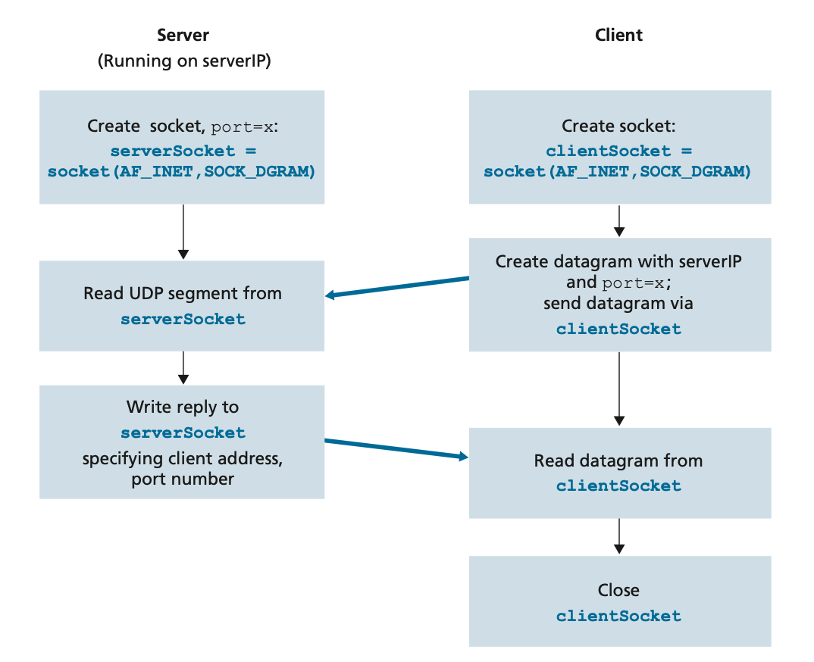
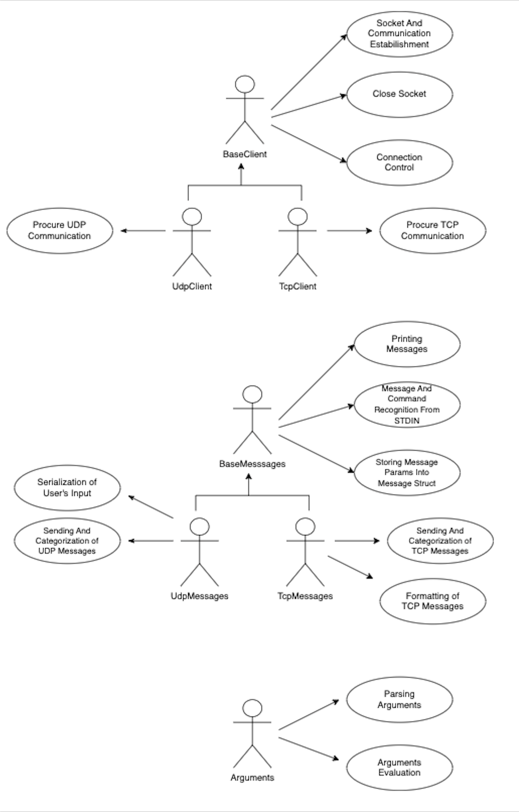

# IPK Project 1: IPK Chat Client
- Author: Tomáš Dolák 
- Login: [xdolak09](https://www.vut.cz/lide/tomas-dolak-247220)
- Email: <xdolak09@stud.fit.vutbr.cz>

The goal of first project for computer communications and networks project is to implement a client for chat server[ using IPK24-CHAT protocol ](https://git.fit.vutbr.cz/NESFIT/IPK-Projects-2024/src/branch/master/Project%201/README.md) which can communicate with any server using  `IPK24-CHAT` protocol.

## Table of contents
- [Requirements](#requirements)
- [Installation](#installation)
- [Project organization](#project-organization)
- [Implementation](#implementation)
  - [Arguments](#arguments)
  - [Users Possiblities](#users-possibilities)
  - [TCP Client](#tcp-client)
    - [Introduction to TCP communication](#introduction-to-tcp-communication)
    - [TCP programming](#tcp-programming)
  - [UDP Client](#udp-client)
    - [Introduction to UDP communication](#introduction-to-udp-communication)
    - [UDP programming](#udp-programming)
  - [Implementation Details](#implementation-details)
- [UML Diagrams](#uml-diagrams)
- [Testing](#testing)
- [Resources](#resources)

## Requirements
To build and run `ipk24chat-client`, you will need the following:

### Compiler
- **Clang++** with support for **C++17** standard. This project uses specific compiler flags to enforce code quality and standards. Make sure your compiler version supports `-std=c++17` along with the flags `-Wall -Wextra -Werror -Wshadow -Wnon-virtual-dtor -pedantic`.

### Libraries
- **Google Test (gtest)**: Required for compiling and running the unit tests. Ensure you have Google Test installed on your system as it uses `-lgtest -lgtest_main -pthread` flags for linking.

### Build tools
- **Make**: This project uses a `Makefile` for easy building and testing. Ensure you have Make installed on your system.

### Operating system
- The Makefile and C++ code were designed with Unix-like environments in mind (Linux, MacOS). While it may be possible to compile and run the project on Windows, using a Unix-like environment (or WSL for Windows users) is recommended.

### Debugging (Optional)
- For debugging, this project uses Clang++'s AddressSanitizer which requires `-fsanitize=address` flag. Ensure your development environment supports AddressSanitizer if you intend to use the debug build.

## Installation
1. Clone the repository to your local machine.
2. Navigate to the project directory.
3. Run `make` to build the client application. This will create the `ipk24chat-client` executable.
4. (Optional) Run `make test` to build and run the unit tests. Ensure you have Google Test installed.
5. (Optional) Run `make debug` to build the application with debug flags enabled.

Please refer to the Makefile for additional targets and commands.

## Project organization 
```
ipk-proj-1/
│
├── include/                # Header files for class declarations
│
├── src/                    # Source files containing class definitions and main application logic
│
├── test/                   # Test files
│   ├── unit-tests/         # Tests for routine operations over messages, inputs, and arguments
│   │   
│   └── tests-with-server/  # Tests of communication with Server
│
├── doc/                    # Documentation files and resources
│   └── pics/               # Directory of pictures used in README.md
│
├── Makefile                # Makefile for compiling the project
│
└── README.md               # Overview and documentation for the project
```

## Implementation 

### Arguments

Arguments that are checked and verified:

| Argument | Value           | Possible Values            | Meaning or Expected Program Behavior                        |
|----------|-----------------|----------------------------|-------------------------------------------------------------|
| `-t`     | User provided   | `tcp` or `udp`             | Transport protocol used for connection                      |
| `-s`     | User provided   | IP address or hostname     | Server IP or hostname                                       |
| `-p`     | `4567`          | 0 to 65535                 | Server port                                                 |
| `-d`     | `250`           | 0 to 65535                 | UDP confirmation timeout in milliseconds                    |
| `-r`     | `3`             | 0 to 255                   | Maximum number of UDP retransmissions                       |
| `-h`     |                 |                            | Prints program help output and exits                        |

**Note:** The arguments `-t`, `-s` are mandatory. Arguments `-p`, `-d`, `-r` have default values, so they are optional. Using `-h` immediately terminates the program with a help statement, regardless of the other arguments provided. If the count of arguments or the count of identifiers are invalid the program will send error message to standard error output.

### User's possibilities 

#### Authentication command 
Authenticates the client. 
```
/auth {Username} {Secret} {DisplayName}
```

#### Join command
Joins Client To Join Specific Channel.
```
/join {ChannelID}
```

#### Rename command 
Sets Different Local Display Name. 
```
/rename {DisplayName}
```

#### Command print help
Prints Help Statement.
```
/help
```
#### Messages
Everything Else As The Previous Commands Are Interpreted As Regular Message.

**Note:** Be aware that there are limitations for `{ChannelID}`, `{DisplayName}`, `{MessageContent}`, and similar fields. For instance, packets should not exceed the default Ethernet MTU of 1500 octets as defined by [RFC 894](https://tools.ietf.org/html/rfc894). Exceeding this limit could result in packet fragmentation, potentially affecting communication efficiency and reliability.

### Unblocking communication with poll()
In programming, when implementing chat client is better to use unblocking communication with poll() rather than busy-waiting for data on the socket. Client can fluently check activity on standard input and socket using poll(), which is a more efficient and elegant solution. The benefits of poll() are that it allows the program to efficiently check multiple sockets for activity simultaneously without wasting CPU time. An alternative to the poll() function is the select() function, which is also commonly used for checking multiple sockets for activity, but may have some limitations in terms of scalability and performance.[3]

### TCP client

#### Introduction to TCP communication

TCP is a reliable and connection-oriented protocol that operates at the transport layer of the TCP/IP protocol suite (T, 2016). It provides reliable, ordered, and error-checked delivery of data packets over an IP network.[5] TCP works by establishing a reliable and ordered connection between two devices, typically a client and a server. During the connection establishment phase, a three-way handshake process is used, where the client and server exchange SYN (synchronize) and ACK (acknowledge) packets to confirm the connection.[4] Once the connection is established, TCP segments the data into small packets and adds sequence numbers to each packet.[8]


#### TCP programming
For TCP connection, we its needed first to establish the socket and then the connection. The important parameter of `socket` function is `SOCK_STREAM`, which specifies TCP socket. Just after creating the socket, the three-way handshake is conducted. The handshake prepares a connection socket on the server side dedicated to the client. All this takes place on the server side and transport layer, which makes it invisible to the client. After this procedure `connect` function is called and the data exchange can start. In textual communication, we don't need any special string for encoding and decoding the message. During the communication is tracked whether "HELLO" and "BYE" messages were sent. [1] [2]

<p align="center">
  <br>
  <em>Ilustration of TCP communication</em>
</p>

The string which is sent is cleared before receiving the message from the server. If the "BYE" message wasn't sent the program will send it anyway and inform the user via error sign, that he forgot to send "BYE". Before closing the socket, the program shuts down the communication in both directions, function `shutdown` and parameter `2` (enum value for shutting down writing and reading). In Windows systems both closing and shutting down are done by `closesocket` After this procedure the socket can be closed (function `close`) and the interaction ends. [1] [2]

<p align="center">
  <br>
  <em>Ilustration of client-server communication using TCP [2]</em>
</p>

### UDP client

#### Introduction to UDP communication

UPD protocol provides a connectionless and unreliable communication service, meaning that it does not establish a dedicated connection between the sender and receiver and does not guarantee the delivery of data packets. Instead, UDP sends data packets, called datagrams, without any acknowledgment or error checking. These datagrams are transmitted independently and can arrive out of order, be duplicated, or even be lost during transmission. The lack of built-in reliability mechanisms in UDP allows fast, low-latency communication, making it ideal for that can tolerate lost packets, such as streaming audio or video, where speed is more crucial than perfect accuracy.[1] [6] [7]

#### UDP programming
For establishing the UDP socket, there is a important parameter of `socket` function - `SOCK_DGRAM`, which specifies UDP socket. Additionally, to send data using UDP, the `sendto` function is used, which allows the client to specify the destination IP address and port number and for receiveing data, the `recvfrom` function is used, which provides the source IP address and port number of the incoming datagram. After the successful establishment of communication, the program processed the input relays from stdin and received messages from the server. Each received message must be confirmed to the CONFIRM server by a message that the message was successfully received and each sent message must be confirmed again by the server. The program also checks the length of received messages from the user and from the server, because the protocol has its limitations defined by the IPK24-protocol. If this limit is exceeded the program sends an ERR message and the program is terminated correctly.

<p align="center">
  <br>
  <em>Ilustration of Client-Server Communication Using UDP [2]</em>
</p>

After encoding the input string into the modified string (according to protocol), the message can be sent. In UDP communication before sending the data, the destination address must be attached to the packet. The Internet will route the data in the packet according to the address attached to it. 
Before receiving the response are both strings cleaned, so it's possible to use them for processing the response.
After receiving a server response the status is checked and the payload is decoded. Depending on its value, either a response or error is printed. And the socket is closed (function `close`).[2]

### Implementation details
The `ipk24chat-client` program is written using an object-oriented approach in c++. The communication between client and server is based on the state machine, described [here](https://git.fit.vutbr.cz/NESFIT/IPK-Projects-2024/src/branch/master/Project%201#user-content-specification). The `poll()` function is used to provide non-blocking logic. The TCP client also uses the `send()` and `receive()` functions and has a simpler state machine because communication based on the TCP protocol is more secure and reliable. The UDP client also uses the `sendto()` and `recvfrom()` functions. For the UDP client, it was also necessary to implement logic for message contol and also dynamic port change, because the server moves the communication with the client to a different port after the authentication message. [10] [11] [12] [13]

**Note:** The program flow can be observed in program flow diagram.

## UML diagrams 

### Program flow diagram 
Diagram showing the program flow.

<p align="center">
  <br>
  <em>program flow diagram</em>
</p>

### Use case diagram 
Use case diagram showing individual classes interacting to resolve communication and what they can do in the system.

<p align="center">
  <br>
  <em>usa case diagram</em>
</p>

## Testing
This section is dedicated to testing the project, so what was tested?
- unit tests on individual class methods
- communication testing with fake server - NETCAT
- bilateral communication with personal local UDP server
- bilateral communication with reference server 
The following subsections will explain the individual parts of the testing.

### Unit tests on individual class methods
The aim of the unit test was to guarantee the correctness and expected behavior of the individual class methods. Testing was performed on critical methods that interact with either STDIN/STDOUT/STDERR or manipulate messages.

**Note:** Not all methods were tasted by unit test, just the critical ones!

### Communication testing with fake server - NETCAT
Netcat, often referred to as the "Swiss Army Knife of networking tools", is a computer tool used for networking. It allows reading from and writing to TCP or UDP network connections using the command line.[9]

Netcat was used to confirm the correctness of the communication based on the `IPK24 protocol`. Both TCP and UDP were tested for a variety of key situations that can occur in reality during client-server communication. Such as:

    1. Client authentication with server rejection or acceptance
    2. The client sends a message other than the authentication message after start of the application
    3. Servers error occurs in authentication state
    4. Multiple messages sent from server to client (Client just as a listener)
    5. Client wants to join another channel and server rejects 
    6. Client wants to join another channel and server accepts
    7. Server in UDP variant sends error message instead of CONFIRM message
    8. Server in UDP variant sends error message instead of REPLY message

### Bilateral communication with personal local UDP server
Testing of the UDP client was conducted on a local chat server to ensure the correct implementation of basic and more complex functionalities. The primary focus was on the clients' ability to handle various communication scenarios that are typical in client-server interactions. The tests were divided into two categories, the first one used file inputs and outputs (input and output files are available in the `/tests/com-tests` folder), the second one was a simulation of a wedge and predefined server responses, no deficiencies were shown when testing both variants. 

**Note:** Note that for the first part of the testing there is also an evaluation script that can be provided.

### Bilateral communication with reference server
Due to the complexity of simulating situations on the reference server using test scripts (because of the interaction with other users contents), only the manual tests with scenarios were tested on the reference server. The test scenarios were described in chapter [Communication testing with fake server - NETCAT](#communication-testing-with-fake-server---netcat). The interaction in all scenarios went as expected i.e. as [specified](https://git.fit.vutbr.cz/NESFIT/IPK-Projects-2024/src/branch/master/README.md). Also was used program [Wireshark](https://www.wireshark.org) with [lua plugin](https://git.fit.vutbr.cz/NESFIT/IPK-Projects-2024/src/branch/master/Project%201/resources) when client was communicate with server to proof right use of `IPK24 protocol`.

### Student tests
Program was also tested on student tests created by [Tomáš Hobza](https://www.vut.cz/lide/tomas-hobza-250583), if you would like to test program on your own, you can do as well [link](https://git.fit.vutbr.cz/xhobza03/ipk-client-test-server). When application was tested by student developed tests, basic `TCP` and `UDP` communication was demonstrated, but coordination ability was also shown to be impaired in the `UDP` variant.

**Note:** Note that these student tests are not official and do not prove the correctness of the application.

## Resources 
[1] [RFC791]: Information Sciences Institute, University of Southern California. "Internet Protocol" [online]. September 1981. [cited 2024-03-26]. DOI: 10.17487/RFC791. Available at [https://www.ietf.org/rfc/rfc793.txt](https://www.ietf.org/rfc/rfc793.txt).

[2] James F. Kurose, Keith W. Ross: *Computer Networking: A Top Down Approach* (Eighth Edition). Figure 2.28 [cited 2024-03-20].

[3] poll(2) — Linux manual page. Linux Documentation [online].[cited 2024-03-29]. Available at [https://man7.org/linux/man-pages/man2/poll.2.html](https://man7.org/linux/man-pages/man2/poll.2.html)

[4] "Difference Between TCP/IP and OSI Model" [online]. [cited 2024-03-29]. Available at [https://techdifferences.com/difference-between-tcp-ip-and-osi-model.html](https://techdifferences.com/difference-between-tcp-ip-and-osi-model.html).

[5] Natarajan Meghanathan: "A Tutorial on Network Security: Attacks and Controls" [online]. [cited 2024-03-29]. Available at [https://arxiv.org/pdf/1412.6017v1.pdf](https://arxiv.org/pdf/1412.6017v1.pdf)

[6] Gorry Fairhurst: "The User Datagram Protocol (UDP)" [online]. 19.11.2008. [cited 2024-03-20]. Available at [https://www.erg.abdn.ac.uk/users/gorry/course/inet-pages/udp.html](https://www.erg.abdn.ac.uk/users/gorry/course/inet-pages/udp.html).

[7] Marek Majkowski: "Everything you ever wanted to know about UDP sockets but were afraid to ask, part 1" [online]. 25.11.2021. [cited 2024-03-26]. Available at [https://blog.cloudflare.com/everything-you-ever-wanted-to-know-about-udp-sockets-but-were-afraid-to-ask-part-1](https://blog.cloudflare.com/everything-you-ever-wanted-to-know-about-udp-sockets-but-were-afraid-to-ask-part-1).

[8] Andrew T. Campbell: "Socket Programming" [online]. December 2023. Available at [https://www.cs.dartmouth.edu/~campbell/cs60/socketprogramming.html](https://www.cs.dartmouth.edu/~campbell/cs60/socketprogramming.html).

[9] "https://cs.wikipedia.org/wiki/Netcat" [online]. [cited 2024-04-01]. Available at [https://cs.wikipedia.org/wiki/Netcat](https://cs.wikipedia.org/wiki/Netcat)

[10] recvfrom(2) - Linux man page [online].[cited 2024-04-01]. Available at [https://linux.die.net/man/2/recvfrom](https://linux.die.net/man/2/recvfrom)

[11] sendto(2) - Linux man page [online].[cited 2024-04-01]. Available at [https://linux.die.net/man/2/sendto](https://linux.die.net/man/2/sendto)

[12] send(3) - Linux man page [online].[cited 2024-04-01]. Available at [https://linux.die.net/man/3/send](https://linux.die.net/man/3/send)

[13] recv(2) - Linux man page [online].[cited 2024-04-01]. Available at [https://linux.die.net/man/2/recv](https://linux.die.net/man/2/recv)